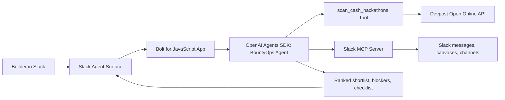

# BountyOps Architecture

Uploadable diagram: [`architecture.svg`](architecture.svg)

## Core flow

1. A builder asks BountyOps to find urgent cash opportunities.
2. The agent calls `scan_cash_hackathons`.
3. The tool scans Devpost open online hackathons, cleans prize data, parses deadlines, filters low-value or risky work, and applies known rule notes checked on 2026-07-09.
4. The agent responds in Slack with a ranked shortlist and one next action.
5. If Slack MCP is connected, the agent can search team context or prepare a canvas, but it does not send, submit, post, sign, pay, or modify accounts without explicit human approval.

## Why it matches Slack Agent Builder

- It uses the Slack Agent surface for direct messages, mentions, and the assistant panel.
- It uses the Slack MCP Server integration path already present in the Slack starter template.
- It automates a real work process: finding near-deadline cash opportunities and turning them into submission-ready action plans.
- It has human-in-the-loop checkpoints for public actions.
