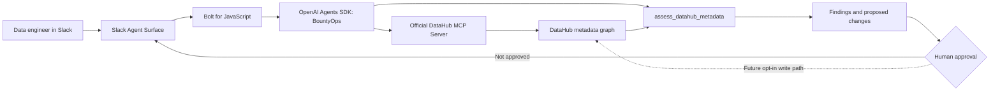

# DataHub Architecture

Uploadable diagram: [`datahub-architecture.svg`](datahub-architecture.svg)

## Runtime Flow

1. A data engineer asks BountyOps to investigate an asset or business concept in Slack.
2. The agent uses the official DataHub MCP server to search, inspect schema, retrieve query context, and trace lineage.
3. `assess_datahub_metadata` applies deterministic checks for missing ownership, blank descriptions, stale freshness, and unclassified high-impact assets.
4. The agent returns evidence, severity, and proposed metadata operations in Slack.
5. The current build stops at review. DataHub mutation tools are disabled by environment configuration and by an SDK allowlist.
