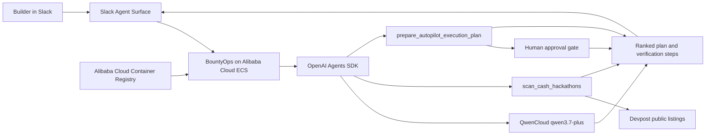

# BountyOps Autopilot Architecture

Uploadable diagram: [`qwen-architecture.svg`](qwen-architecture.svg)

## Runtime flow

1. A builder gives BountyOps an ambiguous opportunity or deadline inside Slack.
2. The Alibaba Cloud ECS deployment forwards the conversation to the agent runtime.
3. QwenCloud interprets the request and decides when to invoke the discovery and planning tools.
4. The discovery tool ranks current opportunities by deadline, reward, fit, and risk.
5. The planning tool converts the chosen opportunity into qualify, plan, build, verify, and publish phases.
6. Publishing, spending, wallet signing, and final submission remain behind a human approval gate.

## Deployment evidence

- `Dockerfile` packages the Slack agent.
- `deploy/alibaba-cloud/deploy-to-ecs.ps1` uses the Alibaba Cloud ECS `RunCommand` API.
- The deployment pulls the image from Alibaba Cloud Container Registry and runs it with restart protection.
- QwenCloud credentials remain in `/opt/bountyops/.env` on the ECS host and are never committed.

## Verification

Run `npm run verify:qwen` before recording the demo. A passing result proves that the configured QwenCloud model completed a live inference request without exposing the API key.
